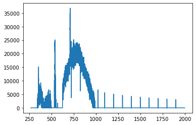
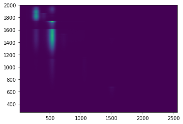
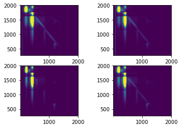
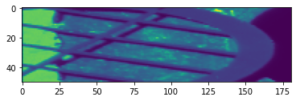

# Example Usage
```python
import sgmdata
import pandas
import numpy as np
from matplotlib import pyplot as plt 
```


<div class="bk-root">
    <a href="https://bokeh.org" target="_blank" class="bk-logo bk-logo-small bk-logo-notebook"></a>
    <span id="1001">Loading BokehJS ...</span>
</div>


## Dask Background 
The whole sgm-data library makes use 'dask' arrays,  this allows for multiprocessing capabilities, 
in a 'pandas-like' programming environment.  The dask client is useful for very large datasets, it sets up workers to propogate your data and the operations upon it across several worker processes / nodes.  For more about dask visit [their website](https://docs.dask.org/en/latest/)

The below cell is optional and, if run, should only be run once per session. Dask will work quicker on small operations without the client (but you may run out of memory).


```python
from dask.distributed import Client
client = Client('dscheduler:8786') ## Can also run Client() for smaller jobs (could be faster).
```

## Searching for Data
You can find your data in the SGMLive database by using the SGMQuery module. The following documentation details the keywords that you can use to customize your search.  

### class SGMQuery(**kwargs):

>**sample** *(str:required)* At minimum you'll need to provide the keyword "sample", corresponding the sample name in the database as a default this will grab all the data under that sample name.

> **daterange** *(tuple:optional)* This can be used to sort through sample data by the day that it was acquired. This is designed to take a tuple of the form `("start-date", "end-date")` where the strings are of the form `"YYYY-MM-DD"`.  You can also just use a single string of the same form, instead of a tuple, this will make the assumption that "end-date" == now().

> **data** *(bool:optional)* As a default (True) the SGMQuery object will try to load the the data from disk, if this is not the desired behaviour set data=False.

> **user** *(str:optional:staffonly)* Can be used to select the username in SGMLive from which the sample query is performed.  Not available to non-staff. 

> **processed** *(bool:optional)* Can be used to return the paths for the processed data (already interpolated) instead of the raw.  You would generally set `data = False` for this option.  

#### Attributes
> **data** (object)  By default the query will create an SGMData object containing your data, this can be turned off with the `data` keyword.

> **paths** (list). Contains the local paths to your data (or processed_data if `processed=True`).


```python
%%time
sgmq = sgmdata.SGMQuery(sample="TeCN - C", user='arthurz')
```


```python
sgm_data = sgmq.data
```

## Loading Data
Data can be loaded in as a single file path, or as a list or paths. The actual data is only loaded as a representation at first.  By default SGMQuery creates an SGMData object under the property 'data'. 


### class SGMData(file_paths, **kwargs):

#### arg

#### Keywords

>**axes** *(str:optional)* At minimum you'll need to provide the keyword "sample", corresponding the sample name in the database as a default this will grab all the data under that sample name.

> **daterange** *(tuple:optional)* This can be used to sort through sample data by the day that it was acquired. This is designed to take a tuple of the form `("start-date", "end-date")` where the strings are of the form `"YYYY-MM-DD"`.  You can also just use a single string of the same form, instead of a tuple, this will make the assumption that "end-date" == now().

> **data** *(bool:optional)* As a default (True) the SGMQuery object will try to load the the data from disk, if this is not the desired behaviour set data=False.

> **user** *(str:optional:staffonly)* Can be used to select the username in SGMLive from which the sample query is performed.  Not available to non-staff. 

> **processed** *(bool:optional)* Can be used to return the paths for the processed data (already interpolated) instead of the raw.  You would generally set `data = False` for this option.  

#### Functions

#### Attributes
> **scans** (object)  By default the query will create an SGMData object containing your data, this can be turned off with the `data` keyword.

> **paths** (list). Contains the local paths to your data (or processed_data if `processed=True`).


The data is auto grouped into three classifications:  "independent", "signals", and "other". You can view the data dictionary representation in a Jupyter cell by just invoking the SGMData() object. 


```python
from sgmdata import preprocess
preprocess(sample="TeCN - C", user='arthurz', resolution=0.1, client=client)
```

    Averaged 10 scans for TeCN - C


<button onclick="window.open('https://sgmdata.lightsource.ca/users/xasexperiment/useravg/7627','processed','width=1000,height=700'); return false;">Open TeCN - C</button>


## The SGMScan object
Contains a representation in memory of the data loaded from disk, plus any interpolated scans. 


```python
sgm_data.scans['2022-02-08t14-56-25-0600']
```


<table>
  <thead>
    <tr><td> </td><th>Sample</th><th> Command </th><th> Independent </th><th> Signals </th><th> Other </th></tr>
  </thead>
  <tbody>
<tr><th> entry3</th><td> TeCN - C </td> <td> ['cscan', 'en', '270', '320', '60'] </td> <td> ['en'] </td> <td> ['aux1', 'clock', 'i0', 'pd', 'sdd1', 'sdd2', 'sdd3', 'sdd4', 'temp1', 'temp2', 'tey'] </td> <td> ['emission', 'image'] </td></tr>
</tbody></table>


```python
sgm_data.scans['2021-08-18t04-14-47-0600'].entry1.command
```


    ['eemscan', 'en', '270', '2000', '60', '100']


```python
sgm_data.scans['2021-08-18t04-14-47-0600'].entry1.independent['en']
```


<table>
<tr>
<td>
<table>
  <thead>
    <tr><td> </td><th> Array </th><th> Chunk </th></tr>
  </thead>
  <tbody>
    <tr><th> Bytes </th><td> 137.20 kiB </td> <td> 45.73 kiB </td></tr>
    <tr><th> Shape </th><td> (35123,) </td> <td> (11707,) </td></tr>
    <tr><th> Count </th><td> 5 Tasks </td><td> 4 Chunks </td></tr>
    <tr><th> Type </th><td> float32 </td><td> numpy.ndarray </td></tr>
  </tbody>
</table>
</td>
<td>
<svg width="170" height="75" style="stroke:rgb(0,0,0);stroke-width:1" >

  <!-- Horizontal lines -->
  <line x1="0" y1="0" x2="120" y2="0" style="stroke-width:2" />
  <line x1="0" y1="25" x2="120" y2="25" style="stroke-width:2" />

  <!-- Vertical lines -->
  <line x1="0" y1="0" x2="0" y2="25" style="stroke-width:2" />
  <line x1="39" y1="0" x2="39" y2="25" />
  <line x1="79" y1="0" x2="79" y2="25" />
  <line x1="119" y1="0" x2="119" y2="25" />
  <line x1="120" y1="0" x2="120" y2="25" style="stroke-width:2" />

  <!-- Colored Rectangle -->
  <polygon points="0.0,0.0 120.0,0.0 120.0,25.412616514582485 0.0,25.412616514582485" style="fill:#ECB172A0;stroke-width:0"/>

  <!-- Text -->
  <text x="60.000000" y="45.412617" font-size="1.0rem" font-weight="100" text-anchor="middle" >35123</text>
  <text x="140.000000" y="12.706308" font-size="1.0rem" font-weight="100" text-anchor="middle" transform="rotate(0,140.000000,12.706308)">1</text>
</svg>
</td>
</tr>
</table>


```python
sgm_data.scans['2021-08-18t04-14-47-0600'].entry1.signals['tey']
```


<table>
<tr>
<td>
<table>
  <thead>
    <tr><td> </td><th> Array </th><th> Chunk </th></tr>
  </thead>
  <tbody>
    <tr><th> Bytes </th><td> 137.20 kiB </td> <td> 45.73 kiB </td></tr>
    <tr><th> Shape </th><td> (35123,) </td> <td> (11707,) </td></tr>
    <tr><th> Count </th><td> 5 Tasks </td><td> 4 Chunks </td></tr>
    <tr><th> Type </th><td> float32 </td><td> numpy.ndarray </td></tr>
  </tbody>
</table>
</td>
<td>
<svg width="170" height="75" style="stroke:rgb(0,0,0);stroke-width:1" >

  <!-- Horizontal lines -->
  <line x1="0" y1="0" x2="120" y2="0" style="stroke-width:2" />
  <line x1="0" y1="25" x2="120" y2="25" style="stroke-width:2" />

  <!-- Vertical lines -->
  <line x1="0" y1="0" x2="0" y2="25" style="stroke-width:2" />
  <line x1="39" y1="0" x2="39" y2="25" />
  <line x1="79" y1="0" x2="79" y2="25" />
  <line x1="119" y1="0" x2="119" y2="25" />
  <line x1="120" y1="0" x2="120" y2="25" style="stroke-width:2" />

  <!-- Colored Rectangle -->
  <polygon points="0.0,0.0 120.0,0.0 120.0,25.412616514582485 0.0,25.412616514582485" style="fill:#ECB172A0;stroke-width:0"/>

  <!-- Text -->
  <text x="60.000000" y="45.412617" font-size="1.0rem" font-weight="100" text-anchor="middle" >35123</text>
  <text x="140.000000" y="12.706308" font-size="1.0rem" font-weight="100" text-anchor="middle" transform="rotate(0,140.000000,12.706308)">1</text>
</svg>
</td>
</tr>
</table>


## Plotting Scan Data
For individual plots, you can visualize access the data, and plot it manually, or you can use the plot() routine. If interpolation step has already been performed, the data will be from that source.


```python
en = sgm_data.scans['2021-08-18t04-14-47-0600'].entry1.independent['en']
tey = sgm_data.scans['2021-08-18t04-14-47-0600'].entry1.signals['tey']

plt.plot(en,tey)
```


    [<matplotlib.lines.Line2D at 0x7f3fad40ffd0>]


    

    


```python
arr = sgm_data.scans['2021-08-18t04-14-47-0600'].entry1.signals['sdd3']
plt.imshow(arr, extent=[10,2560, 270, 2000])
```


    <matplotlib.image.AxesImage at 0x7f3fad319550>


    

    


```python
arr1 = sgm_data.scans['2021-08-18t04-14-47-0600'].entry1.signals['sdd1']
arr2 = sgm_data.scans['2021-08-18t04-14-47-0600'].entry1.signals['sdd2']
arr3 = sgm_data.scans['2021-08-18t04-14-47-0600'].entry1.signals['sdd3']
arr4 = sgm_data.scans['2021-08-18t04-14-47-0600'].entry1.signals['sdd4']

fig, axs = plt.subplots(2, 2)
axs[0,0].imshow(arr1, extent=[10,2000, 270, 2000], vmin = 1, vmax = 1000)
axs[0,1].imshow(arr2, extent=[10,2000, 270, 2000], vmin = 1, vmax = 1000)
axs[1,0].imshow(arr3, extent=[10,2000, 270, 2000], vmin = 1, vmax = 1000)
axs[1,1].imshow(arr4, extent=[10,2000, 270, 2000], vmin = 1, vmax = 1000)
```


    <matplotlib.image.AxesImage at 0x7f3f8c2b25b0>


    

    


```python
sgm_data.scans['2021-08-18t04-14-47-0600'].entry1.plot()
```

## Interpolating Data
Individual scans are loaded into the SGMData namespace, and can be interpolated from here. By selecting compute == False we can stage the dask array computation to occur at a later time (e.g. by running object.compute()).  


```python
df = sgm_data.scans['2021-08-18t04-14-47-0600'].entry1.interpolate(resolution=0.25)
```


```python
sgm_data.scans['2021-01-21t13-47-04-0600'].entry2.keys()
```


    dict_keys(['command', 'sample', 'description', 'independent', 'signals', 'other', 'npartitions', 'new_axes', 'dataframe', 'binned'])


```python
sgm_data.scans['2021-01-21t13-47-04-0600'].entry2.binned['dataframe']
```


<div>
<style scoped>
    .dataframe tbody tr th:only-of-type {
        vertical-align: middle;
    }

    .dataframe tbody tr th {
        vertical-align: top;
    }

    .dataframe thead th {
        text-align: right;
    }
</style>
<table border="1" class="dataframe">
  <thead>
    <tr style="text-align: right;">
      <th></th>
      <th>aux1</th>
      <th>clock</th>
      <th>i0</th>
      <th>pd</th>
      <th>sdd1-0</th>
      <th>sdd1-1</th>
      <th>sdd1-2</th>
      <th>sdd1-3</th>
      <th>sdd1-4</th>
      <th>sdd1-5</th>
      <th>...</th>
      <th>sdd4-249</th>
      <th>sdd4-250</th>
      <th>sdd4-251</th>
      <th>sdd4-252</th>
      <th>sdd4-253</th>
      <th>sdd4-254</th>
      <th>sdd4-255</th>
      <th>temp1</th>
      <th>temp2</th>
      <th>tey</th>
    </tr>
    <tr>
      <th>en</th>
      <th></th>
      <th></th>
      <th></th>
      <th></th>
      <th></th>
      <th></th>
      <th></th>
      <th></th>
      <th></th>
      <th></th>
      <th></th>
      <th></th>
      <th></th>
      <th></th>
      <th></th>
      <th></th>
      <th></th>
      <th></th>
      <th></th>
      <th></th>
      <th></th>
    </tr>
  </thead>
  <tbody>
    <tr>
      <th>440.000000</th>
      <td>0.0</td>
      <td>0.022239</td>
      <td>72052.909091</td>
      <td>403.454545</td>
      <td>0.0</td>
      <td>0.0</td>
      <td>0.0</td>
      <td>0.0</td>
      <td>0.0</td>
      <td>0.0</td>
      <td>...</td>
      <td>0.0</td>
      <td>0.0</td>
      <td>0.0</td>
      <td>0.0</td>
      <td>0.0</td>
      <td>0.0</td>
      <td>0.0</td>
      <td>81.363636</td>
      <td>186.818182</td>
      <td>12242.818182</td>
    </tr>
    <tr>
      <th>440.100167</th>
      <td>0.0</td>
      <td>0.022102</td>
      <td>69012.800000</td>
      <td>415.800000</td>
      <td>0.0</td>
      <td>0.0</td>
      <td>0.0</td>
      <td>0.0</td>
      <td>0.0</td>
      <td>0.0</td>
      <td>...</td>
      <td>0.0</td>
      <td>0.0</td>
      <td>0.0</td>
      <td>0.0</td>
      <td>0.0</td>
      <td>0.0</td>
      <td>0.0</td>
      <td>72.000000</td>
      <td>181.200000</td>
      <td>12866.400000</td>
    </tr>
    <tr>
      <th>440.200334</th>
      <td>0.0</td>
      <td>0.022747</td>
      <td>73289.000000</td>
      <td>402.714286</td>
      <td>0.0</td>
      <td>0.0</td>
      <td>0.0</td>
      <td>0.0</td>
      <td>0.0</td>
      <td>0.0</td>
      <td>...</td>
      <td>0.0</td>
      <td>0.0</td>
      <td>0.0</td>
      <td>0.0</td>
      <td>0.0</td>
      <td>0.0</td>
      <td>0.0</td>
      <td>79.857143</td>
      <td>193.428571</td>
      <td>12280.000000</td>
    </tr>
    <tr>
      <th>440.300501</th>
      <td>0.0</td>
      <td>0.022295</td>
      <td>71447.500000</td>
      <td>411.000000</td>
      <td>0.0</td>
      <td>0.0</td>
      <td>0.0</td>
      <td>0.0</td>
      <td>0.0</td>
      <td>0.0</td>
      <td>...</td>
      <td>0.0</td>
      <td>0.0</td>
      <td>0.0</td>
      <td>0.0</td>
      <td>0.0</td>
      <td>0.0</td>
      <td>0.0</td>
      <td>81.333333</td>
      <td>187.166667</td>
      <td>12558.166667</td>
    </tr>
    <tr>
      <th>440.400668</th>
      <td>0.0</td>
      <td>0.022429</td>
      <td>71883.166667</td>
      <td>408.333333</td>
      <td>0.0</td>
      <td>0.0</td>
      <td>0.0</td>
      <td>0.0</td>
      <td>0.0</td>
      <td>0.0</td>
      <td>...</td>
      <td>0.0</td>
      <td>0.0</td>
      <td>0.0</td>
      <td>0.0</td>
      <td>0.0</td>
      <td>0.0</td>
      <td>0.0</td>
      <td>81.166667</td>
      <td>192.833333</td>
      <td>12588.000000</td>
    </tr>
    <tr>
      <th>...</th>
      <td>...</td>
      <td>...</td>
      <td>...</td>
      <td>...</td>
      <td>...</td>
      <td>...</td>
      <td>...</td>
      <td>...</td>
      <td>...</td>
      <td>...</td>
      <td>...</td>
      <td>...</td>
      <td>...</td>
      <td>...</td>
      <td>...</td>
      <td>...</td>
      <td>...</td>
      <td>...</td>
      <td>...</td>
      <td>...</td>
      <td>...</td>
    </tr>
    <tr>
      <th>499.599332</th>
      <td>0.0</td>
      <td>0.019963</td>
      <td>83576.600000</td>
      <td>390.200000</td>
      <td>0.0</td>
      <td>0.0</td>
      <td>0.0</td>
      <td>0.0</td>
      <td>0.0</td>
      <td>0.0</td>
      <td>...</td>
      <td>0.0</td>
      <td>0.0</td>
      <td>0.0</td>
      <td>0.0</td>
      <td>0.0</td>
      <td>0.0</td>
      <td>0.0</td>
      <td>79.800000</td>
      <td>179.800000</td>
      <td>36676.000000</td>
    </tr>
    <tr>
      <th>499.699499</th>
      <td>0.0</td>
      <td>0.020021</td>
      <td>85236.166667</td>
      <td>391.000000</td>
      <td>0.0</td>
      <td>0.0</td>
      <td>0.0</td>
      <td>0.0</td>
      <td>0.0</td>
      <td>0.0</td>
      <td>...</td>
      <td>0.0</td>
      <td>0.0</td>
      <td>0.0</td>
      <td>0.0</td>
      <td>0.0</td>
      <td>0.0</td>
      <td>0.0</td>
      <td>90.333333</td>
      <td>190.666667</td>
      <td>36227.333333</td>
    </tr>
    <tr>
      <th>499.799666</th>
      <td>0.0</td>
      <td>0.019952</td>
      <td>84377.800000</td>
      <td>400.600000</td>
      <td>0.0</td>
      <td>0.0</td>
      <td>0.0</td>
      <td>0.0</td>
      <td>0.0</td>
      <td>0.0</td>
      <td>...</td>
      <td>0.0</td>
      <td>0.0</td>
      <td>0.0</td>
      <td>0.0</td>
      <td>0.0</td>
      <td>0.0</td>
      <td>0.0</td>
      <td>79.600000</td>
      <td>190.200000</td>
      <td>36549.800000</td>
    </tr>
    <tr>
      <th>499.899833</th>
      <td>0.0</td>
      <td>0.019913</td>
      <td>82349.000000</td>
      <td>393.000000</td>
      <td>0.0</td>
      <td>0.0</td>
      <td>0.0</td>
      <td>0.0</td>
      <td>0.0</td>
      <td>0.0</td>
      <td>...</td>
      <td>0.0</td>
      <td>0.0</td>
      <td>0.0</td>
      <td>0.0</td>
      <td>0.0</td>
      <td>0.0</td>
      <td>0.0</td>
      <td>74.666667</td>
      <td>183.500000</td>
      <td>36853.833333</td>
    </tr>
    <tr>
      <th>500.000000</th>
      <td>0.0</td>
      <td>0.021838</td>
      <td>84041.473214</td>
      <td>392.348214</td>
      <td>0.0</td>
      <td>0.0</td>
      <td>0.0</td>
      <td>0.0</td>
      <td>0.0</td>
      <td>0.0</td>
      <td>...</td>
      <td>0.0</td>
      <td>0.0</td>
      <td>0.0</td>
      <td>0.0</td>
      <td>0.0</td>
      <td>0.0</td>
      <td>0.0</td>
      <td>80.339286</td>
      <td>188.361607</td>
      <td>36589.477679</td>
    </tr>
  </tbody>
</table>
<p>600 rows × 1031 columns</p>
</div>


```python
sgm_data.scans['2021-01-21t13-47-04-0600'].entry2.plot()
```

    Plotting Interpolated Data


<div class="bk-root" id="93ffd7dc-075f-4234-84f2-c39208dfa99b" data-root-id="3754"></div>


### Batch interpolation
You can also batch interpolate the loaded scans from the top of the namespace.  
<i>Note: this process is only applicable if all scans loaded in the namespace can take the same interpolation parameters.</i> 


```python
%%time
interp_list = sgm_data.interpolate(resolution=0.1, start=450, stop=470)
```


      0%|          | 0/10 [00:00<?, ?it/s]


    CPU times: user 27.3 s, sys: 15.1 s, total: 42.4 s
    Wall time: 42.2 s


## Averaging Data
Scans that are loaded into the SGMData namespace, with a corresponding sample name and command can be grouped together and averaged. 


```python
%%time
averaged = sgm_data.mean()
```

    CPU times: user 49 ms, sys: 26.7 ms, total: 75.7 ms
    Wall time: 56.5 ms


You can plot <b>Averaged Data</b>, from the list of 'like' scans using the plot() function.


```python
sgm_data.averaged['TiO2 - Ti'][0].plot()
```


<div class="bk-root" id="30458763-a78d-48e4-ab0d-9636e7b193a9" data-root-id="4383"></div>


```python
df =averaged['TiO2 - Ti'][0]['data']
```


```python
df.filter(regex="sdd2.*").to_numpy().shape
```


    (200, 256)


## Fitting XRF Spectra
Using any data set for which an interpolation has already been performed, the fit_mcas function can be used to find peaks and batch fit them for all four sdd detectors.  


```python
%%time
sgm_data = sgmdata.SGMQuery(sample="Focus Testing 2").data
sgm_data
```


      0%|          | 0/35 [00:00<?, ?it/s]


    CPU times: user 2.63 s, sys: 784 ms, total: 3.41 s
    Wall time: 5.07 s


    /opt/conda/lib/python3.8/site-packages/sgmdata/load.py:493: UserWarning: Some scan files were not loaded: ['2021-07-29t14-49-46-0600', '2021-07-29t11-24-27-0600']
      warnings.warn(f"Some scan files were not loaded: {err}")


<table>
  <thead>
    <tr><th>File</th><th> Entry </th><th> Sample </th><th> Command </th><th> Independent </th><th> Signals </th><th> Other </th></tr>
  </thead>
  <tbody>
<tr><th>2021-07-29t14-54-37-0600</th><td>entry35</td><td> Focus Testing 2 </td> <td> ['cmesh', 'xp', '6.2', '5.7', '10', 'yp', '-0.8', '-1.1'] </td> <td> ['xp', 'yp'] </td> <td> ['aux1', 'clock', 'i0', 'pd', 'sdd1', 'sdd2', 'sdd3', 'sdd4', 'temp1', 'temp2', 'tey'] </td> <td> ['emission', 'image'] </td></tr>
<tr><th>2021-07-29t14-46-01-0600</th><td>entry33</td><td> Focus Testing 2 </td> <td> ['cscan', 'hex_y', '-9.5576', '-8.5576'] </td> <td> ['hex_y'] </td> <td> ['aux1', 'clock', 'i0', 'pd', 'sdd1', 'sdd2', 'sdd3', 'sdd4', 'temp1', 'temp2', 'tey'] </td> <td> ['emission', 'image'] </td></tr>
<tr><th>2021-07-29t14-45-30-0600</th><td>entry32</td><td> Focus Testing 2 </td> <td> ['cscan', 'hex_x', '-2.1949', '-1.1949'] </td> <td> ['hex_x'] </td> <td> ['aux1', 'clock', 'i0', 'pd', 'sdd1', 'sdd2', 'sdd3', 'sdd4', 'temp1', 'temp2', 'tey'] </td> <td> ['emission', 'image'] </td></tr>
<tr><th>2021-07-29t14-30-48-0600</th><td>entry31</td><td> Focus Testing 2 </td> <td> ['cscan', 'hex_y', '-9.5576', '-8.5576'] </td> <td> ['hex_y'] </td> <td> ['aux1', 'clock', 'i0', 'pd', 'sdd1', 'sdd2', 'sdd3', 'sdd4', 'temp1', 'temp2', 'tey'] </td> <td> ['emission', 'image'] </td></tr>
<tr><th>2021-07-29t14-27-43-0600</th><td>entry30</td><td> Focus Testing 2 </td> <td> ['cscan', 'hex_x', '-2.1949', '-1.1949'] </td> <td> ['hex_x'] </td> <td> ['aux1', 'clock', 'i0', 'pd', 'sdd1', 'sdd2', 'sdd3', 'sdd4', 'temp1', 'temp2', 'tey'] </td> <td> ['emission', 'image'] </td></tr>
<tr><th>2021-07-29t13-04-30-0600</th><td>entry29</td><td> Focus Testing 2 </td> <td> ['cmesh', 'xp', '7', '5', '10', 'yp', '1', '-1'] </td> <td> ['xp', 'yp'] </td> <td> ['aux1', 'clock', 'i0', 'pd', 'sdd1', 'sdd2', 'sdd3', 'sdd4', 'temp1', 'temp2', 'tey'] </td> <td> ['emission', 'image'] </td></tr>
<tr><th>2021-07-29t13-01-16-0600</th><td>entry28</td><td> Focus Testing 2 </td> <td> ['cmesh', 'xp', '7', '5', '10', 'yp', '1', '-1'] </td> <td> ['xp', 'yp'] </td> <td> ['aux1', 'clock', 'i0', 'pd', 'sdd1', 'sdd2', 'sdd3', 'sdd4', 'temp1', 'temp2', 'tey'] </td> <td> ['emission', 'image'] </td></tr>
<tr><th>2021-07-29t12-56-50-0600</th><td>entry27</td><td> Focus Testing 2 </td> <td> ['cscan', 'hex_x', '-2.1949', '-1.1949'] </td> <td> ['hex_x'] </td> <td> ['aux1', 'clock', 'i0', 'pd', 'sdd1', 'sdd2', 'sdd3', 'sdd4', 'temp1', 'temp2', 'tey'] </td> <td> ['emission', 'image'] </td></tr>
<tr><th>2021-07-29t12-53-38-0600</th><td>entry26</td><td> Focus Testing 2 </td> <td> ['cscan', 'hex_x', '-2.1949', '-1.1949'] </td> <td> ['hex_x'] </td> <td> ['aux1', 'clock', 'i0', 'pd', 'sdd1', 'sdd2', 'sdd3', 'sdd4', 'temp1', 'temp2', 'tey'] </td> <td> ['emission', 'image'] </td></tr>
<tr><th>2021-07-29t12-51-54-0600</th><td>entry25</td><td> Focus Testing 2 </td> <td> ['cscan', 'hex_x', '-2.1949', '-1.1949'] </td> <td> ['hex_x'] </td> <td> ['aux1', 'clock', 'i0', 'pd', 'sdd1', 'sdd2', 'sdd3', 'sdd4', 'temp1', 'temp2', 'tey'] </td> <td> ['emission', 'image'] </td></tr>
<tr><th>2021-07-29t12-48-04-0600</th><td>entry24</td><td> Focus Testing 2 </td> <td> ['cscan', 'hex_x', '-2.1948', '-1.1948'] </td> <td> ['hex_x'] </td> <td> ['aux1', 'clock', 'i0', 'pd', 'sdd1', 'sdd2', 'sdd3', 'sdd4', 'temp1', 'temp2', 'tey'] </td> <td> ['emission', 'image'] </td></tr>
<tr><th>2021-07-29t12-47-22-0600</th><td>entry23</td><td> Focus Testing 2 </td> <td> ['cscan', 'hex_x', '-2.1949', '-1.1949'] </td> <td> ['hex_x'] </td> <td> ['aux1', 'clock', 'i0', 'pd', 'sdd1', 'sdd2', 'sdd3', 'sdd4', 'temp1', 'temp2', 'tey'] </td> <td> ['emission', 'image'] </td></tr>
<tr><th>2021-07-29t12-46-42-0600</th><td>entry22</td><td> Focus Testing 2 </td> <td> ['cscan', 'hex_x', '-2.1948', '-1.1948'] </td> <td> ['hex_x'] </td> <td> ['aux1', 'clock', 'i0', 'pd', 'sdd1', 'sdd2', 'sdd3', 'sdd4', 'temp1', 'temp2', 'tey'] </td> <td> ['emission', 'image'] </td></tr>
<tr><th>2021-07-29t12-38-23-0600</th><td>entry21</td><td> Focus Testing 2 </td> <td> ['cscan', 'hex_x', '-2.1949', '-1.1949'] </td> <td> ['hex_x'] </td> <td> ['aux1', 'clock', 'i0', 'pd', 'sdd1', 'sdd2', 'sdd3', 'sdd4', 'temp1', 'temp2', 'tey'] </td> <td> ['emission', 'image'] </td></tr>
<tr><th>2021-07-29t12-37-50-0600</th><td>entry20</td><td> Focus Testing 2 </td> <td> ['cscan', 'hex_y', '-9.5576', '-8.5576'] </td> <td> ['hex_y'] </td> <td> ['aux1', 'clock', 'i0', 'pd', 'sdd1', 'sdd2', 'sdd3', 'sdd4', 'temp1', 'temp2', 'tey'] </td> <td> ['emission', 'image'] </td></tr>
<tr><th>2021-07-29t12-37-16-0600</th><td>entry19</td><td> Focus Testing 2 </td> <td> ['cscan', 'hex_y', '-9.5576', '-8.5576'] </td> <td> ['hex_y'] </td> <td> ['aux1', 'clock', 'i0', 'pd', 'sdd1', 'sdd2', 'sdd3', 'sdd4', 'temp1', 'temp2', 'tey'] </td> <td> ['emission', 'image'] </td></tr>
<tr><th>2021-07-29t12-36-41-0600</th><td>entry18</td><td> Focus Testing 2 </td> <td> ['cscan', 'hex_y', '-9.5576', '-8.5576'] </td> <td> ['hex_y'] </td> <td> ['aux1', 'clock', 'i0', 'pd', 'sdd1', 'sdd2', 'sdd3', 'sdd4', 'temp1', 'temp2', 'tey'] </td> <td> ['emission', 'image'] </td></tr>
<tr><th>2021-07-29t12-35-32-0600</th><td>entry17</td><td> Focus Testing 2 </td> <td> ['cscan', 'hex_y', '-9.5576', '-8.5576'] </td> <td> ['hex_y'] </td> <td> ['aux1', 'clock', 'i0', 'pd', 'sdd1', 'sdd2', 'sdd3', 'sdd4', 'temp1', 'temp2', 'tey'] </td> <td> ['emission', 'image'] </td></tr>
<tr><th>2021-07-29t12-34-50-0600</th><td>entry16</td><td> Focus Testing 2 </td> <td> ['cscan', 'hex_y', '-9.5576', '-8.5576'] </td> <td> ['hex_y'] </td> <td> ['aux1', 'clock', 'i0', 'pd', 'sdd1', 'sdd2', 'sdd3', 'sdd4', 'temp1', 'temp2', 'tey'] </td> <td> ['emission', 'image'] </td></tr>
<tr><th>2021-07-29t12-34-12-0600</th><td>entry15</td><td> Focus Testing 2 </td> <td> ['cscan', 'hex_y', '-9.5576', '-8.5576'] </td> <td> ['hex_y'] </td> <td> ['aux1', 'clock', 'i0', 'pd', 'sdd1', 'sdd2', 'sdd3', 'sdd4', 'temp1', 'temp2', 'tey'] </td> <td> ['emission', 'image'] </td></tr>
<tr><th>2021-07-29t12-33-26-0600</th><td>entry14</td><td> Focus Testing 2 </td> <td> ['cscan', 'hex_y', '-9.5576', '-8.5576'] </td> <td> ['hex_y'] </td> <td> ['aux1', 'clock', 'i0', 'pd', 'sdd1', 'sdd2', 'sdd3', 'sdd4', 'temp1', 'temp2', 'tey'] </td> <td> ['emission', 'image'] </td></tr>
<tr><th>2021-07-29t12-32-46-0600</th><td>entry13</td><td> Focus Testing 2 </td> <td> ['cscan', 'hex_y', '-9.5576', '-8.5576'] </td> <td> ['hex_y'] </td> <td> ['aux1', 'clock', 'i0', 'pd', 'sdd1', 'sdd2', 'sdd3', 'sdd4', 'temp1', 'temp2', 'tey'] </td> <td> ['emission', 'image'] </td></tr>
<tr><th>2021-07-29t12-01-05-0600</th><td>entry12</td><td> Focus Testing 2 </td> <td> ['cscan', 'hex_y', '-9.5576', '-8.5576'] </td> <td> ['hex_y'] </td> <td> ['aux1', 'clock', 'i0', 'pd', 'sdd1', 'sdd2', 'sdd3', 'sdd4', 'temp1', 'temp2', 'tey'] </td> <td> ['emission', 'image'] </td></tr>
<tr><th>2021-07-29t12-00-01-0600</th><td>entry11</td><td> Focus Testing 2 </td> <td> ['cscan', 'hex_y', '-9.5574', '-8.5574'] </td> <td> ['hex_y'] </td> <td> ['aux1', 'clock', 'i0', 'pd', 'sdd1', 'sdd2', 'sdd3', 'sdd4', 'temp1', 'temp2', 'tey'] </td> <td> ['emission', 'image'] </td></tr>
<tr><th>2021-07-29t11-55-41-0600</th><td>entry10</td><td> Focus Testing 2 </td> <td> ['cscan', 'hex_x', '-2.1948', '-1.1948'] </td> <td> ['hex_x'] </td> <td> ['aux1', 'clock', 'i0', 'pd', 'sdd1', 'sdd2', 'sdd3', 'sdd4', 'temp1', 'temp2', 'tey'] </td> <td> ['emission', 'image'] </td></tr>
<tr><th>2021-07-29t11-50-14-0600</th><td>entry9</td><td> Focus Testing 2 </td> <td> ['cscan', 'hex_x', '-2.1949', '-1.1949'] </td> <td> ['hex_x'] </td> <td> ['aux1', 'clock', 'i0', 'pd', 'sdd1', 'sdd2', 'sdd3', 'sdd4', 'temp1', 'temp2', 'tey'] </td> <td> ['emission', 'image'] </td></tr>
<tr><th>2021-07-29t11-40-01-0600</th><td>entry8</td><td> Focus Testing 2 </td> <td> ['cscan', 'hex_x', '-2.1948', '-1.1948'] </td> <td> ['hex_x'] </td> <td> ['aux1', 'clock', 'i0', 'pd', 'sdd1', 'sdd2', 'sdd3', 'sdd4', 'temp1', 'temp2', 'tey'] </td> <td> ['emission', 'image'] </td></tr>
<tr><th>2021-07-29t11-31-42-0600</th><td>entry7</td><td> Focus Testing 2 </td> <td> ['cscan', 'hex_x', '-2.2467', '-1.2467'] </td> <td> ['hex_x'] </td> <td> ['aux1', 'clock', 'i0', 'pd', 'sdd1', 'sdd2', 'sdd3', 'sdd4', 'tey'] </td> <td> ['emission', 'image'] </td></tr>
<tr><th>2021-07-29t11-28-15-0600</th><td>entry6</td><td> Focus Testing 2 </td> <td> ['cscan', 'hex_x', '-2.0383', '0'] </td> <td> ['hex_x'] </td> <td> ['aux1', 'clock', 'i0', 'pd', 'sdd1', 'sdd2', 'sdd3', 'sdd4', 'tey'] </td> <td> ['emission', 'image'] </td></tr>
<tr><th>2021-07-29t11-21-34-0600</th><td>entry4</td><td> Focus Testing 2 </td> <td> ['cscan', 'hex_y', '-9.75', '-8'] </td> <td> ['hex_y'] </td> <td> ['aux1', 'clock', 'i0', 'pd', 'sdd1', 'sdd2', 'sdd3', 'sdd4', 'tey'] </td> <td> ['emission', 'image'] </td></tr>
<tr><th>2021-07-29t11-18-07-0600</th><td>entry3</td><td> Focus Testing 2 </td> <td> ['cscan', 'hex_x', '-2.24', '0'] </td> <td> ['hex_x'] </td> <td> ['aux1', 'clock', 'i0', 'pd', 'sdd1', 'sdd2', 'sdd3', 'sdd4', 'tey'] </td> <td> ['emission', 'image'] </td></tr>
<tr><th>2021-07-29t11-06-02-0600</th><td>entry2</td><td> Focus Testing 2 </td> <td> ['cscan', 'yp', '2', '-2'] </td> <td> ['yp'] </td> <td> ['aux1', 'clock', 'i0', 'pd', 'sdd1', 'sdd2', 'sdd3', 'sdd4', 'tey'] </td> <td> ['emission', 'image'] </td></tr>
<tr><th>2021-07-29t11-00-29-0600</th><td>entry1</td><td> Focus Testing 2 </td> <td> ['cmesh', 'hex_x', '-1', '-2', '5', 'hex_y', '0', '-1'] </td> <td> ['hex_x', 'hex_y'] </td> <td> ['aux1', 'clock', 'i0', 'pd', 'sdd1', 'sdd2', 'sdd3', 'sdd4', 'tey'] </td> <td> ['emission', 'image'] </td></tr>
</tbody></table>


```python
xrange = (7.0, 5.0)
yrange = (-1.0, 1.0)
dx = abs(xrange[0] - xrange[1])/(int(10)* 20)
dy = abs(yrange[0] - yrange[1])/50

sgm_data.scans['2021-07-29t13-04-30-0600'].entry29.interpolate(resolution=[dx, dy], start=[min(xrange),min(yrange)], stop=[max(xrange), max(yrange)])
```

    /opt/conda/lib/python3.8/site-packages/sgmdata/load.py:142: UserWarning: Resolution setting can't be higher than experimental resolution, setting resolution for axis 0 to 0.011050
      warnings.warn(


<div>
<style scoped>
    .dataframe tbody tr th:only-of-type {
        vertical-align: middle;
    }

    .dataframe tbody tr th {
        vertical-align: top;
    }

    .dataframe thead th {
        text-align: right;
    }
</style>
<table border="1" class="dataframe">
  <thead>
    <tr style="text-align: right;">
      <th></th>
      <th></th>
      <th>aux1</th>
      <th>clock</th>
      <th>i0</th>
      <th>pd</th>
      <th>sdd1-0</th>
      <th>sdd1-1</th>
      <th>sdd1-2</th>
      <th>sdd1-3</th>
      <th>sdd1-4</th>
      <th>sdd1-5</th>
      <th>...</th>
      <th>sdd4-249</th>
      <th>sdd4-250</th>
      <th>sdd4-251</th>
      <th>sdd4-252</th>
      <th>sdd4-253</th>
      <th>sdd4-254</th>
      <th>sdd4-255</th>
      <th>temp1</th>
      <th>temp2</th>
      <th>tey</th>
    </tr>
    <tr>
      <th>xp</th>
      <th>yp</th>
      <th></th>
      <th></th>
      <th></th>
      <th></th>
      <th></th>
      <th></th>
      <th></th>
      <th></th>
      <th></th>
      <th></th>
      <th></th>
      <th></th>
      <th></th>
      <th></th>
      <th></th>
      <th></th>
      <th></th>
      <th></th>
      <th></th>
      <th></th>
      <th></th>
    </tr>
  </thead>
  <tbody>
    <tr>
      <th rowspan="5" valign="top">5.0</th>
      <th>-1.000000</th>
      <td>0.0</td>
      <td>0.038073</td>
      <td>93013.000000</td>
      <td>1085.000000</td>
      <td>0.0</td>
      <td>0.000000</td>
      <td>0.000000</td>
      <td>0.00</td>
      <td>0.000000</td>
      <td>0.000000</td>
      <td>...</td>
      <td>0.000000</td>
      <td>0.000000</td>
      <td>0.000000</td>
      <td>0.000000</td>
      <td>0.000000</td>
      <td>0.000000</td>
      <td>0.00</td>
      <td>69.333333</td>
      <td>227.000000</td>
      <td>108924.666667</td>
    </tr>
    <tr>
      <th>-0.959184</th>
      <td>0.0</td>
      <td>0.042672</td>
      <td>93184.250000</td>
      <td>1095.500000</td>
      <td>0.0</td>
      <td>0.250000</td>
      <td>0.500000</td>
      <td>0.75</td>
      <td>1.000000</td>
      <td>1.250000</td>
      <td>...</td>
      <td>62.250000</td>
      <td>62.500000</td>
      <td>62.750000</td>
      <td>63.000000</td>
      <td>63.250000</td>
      <td>63.500000</td>
      <td>63.75</td>
      <td>63.250000</td>
      <td>247.500000</td>
      <td>59221.000000</td>
    </tr>
    <tr>
      <th>-0.918367</th>
      <td>0.0</td>
      <td>0.041661</td>
      <td>93632.250000</td>
      <td>1091.500000</td>
      <td>0.0</td>
      <td>0.250000</td>
      <td>0.500000</td>
      <td>0.75</td>
      <td>1.000000</td>
      <td>1.250000</td>
      <td>...</td>
      <td>68.079277</td>
      <td>62.500000</td>
      <td>62.750000</td>
      <td>68.829277</td>
      <td>63.250000</td>
      <td>63.500000</td>
      <td>63.75</td>
      <td>65.250000</td>
      <td>240.250000</td>
      <td>61433.250000</td>
    </tr>
    <tr>
      <th>-0.877551</th>
      <td>0.0</td>
      <td>0.041528</td>
      <td>92952.250000</td>
      <td>1094.750000</td>
      <td>0.0</td>
      <td>0.250000</td>
      <td>0.500000</td>
      <td>0.75</td>
      <td>1.000000</td>
      <td>1.250000</td>
      <td>...</td>
      <td>67.763397</td>
      <td>62.500000</td>
      <td>62.750000</td>
      <td>63.000000</td>
      <td>63.250000</td>
      <td>63.500000</td>
      <td>63.75</td>
      <td>71.500000</td>
      <td>258.000000</td>
      <td>70244.250000</td>
    </tr>
    <tr>
      <th>-0.836735</th>
      <td>0.0</td>
      <td>0.039283</td>
      <td>92714.000000</td>
      <td>1094.000000</td>
      <td>0.0</td>
      <td>0.250000</td>
      <td>0.500000</td>
      <td>0.75</td>
      <td>1.000000</td>
      <td>1.250000</td>
      <td>...</td>
      <td>68.607590</td>
      <td>62.500000</td>
      <td>62.750000</td>
      <td>63.000000</td>
      <td>63.250000</td>
      <td>63.500000</td>
      <td>63.75</td>
      <td>68.250000</td>
      <td>248.250000</td>
      <td>65700.000000</td>
    </tr>
    <tr>
      <th>...</th>
      <th>...</th>
      <td>...</td>
      <td>...</td>
      <td>...</td>
      <td>...</td>
      <td>...</td>
      <td>...</td>
      <td>...</td>
      <td>...</td>
      <td>...</td>
      <td>...</td>
      <td>...</td>
      <td>...</td>
      <td>...</td>
      <td>...</td>
      <td>...</td>
      <td>...</td>
      <td>...</td>
      <td>...</td>
      <td>...</td>
      <td>...</td>
      <td>...</td>
    </tr>
    <tr>
      <th rowspan="5" valign="top">7.0</th>
      <th>0.836735</th>
      <td>0.0</td>
      <td>0.045666</td>
      <td>93865.333333</td>
      <td>1093.333333</td>
      <td>0.0</td>
      <td>0.333333</td>
      <td>0.666667</td>
      <td>1.00</td>
      <td>1.333333</td>
      <td>1.666667</td>
      <td>...</td>
      <td>83.000000</td>
      <td>83.333333</td>
      <td>83.666667</td>
      <td>84.000000</td>
      <td>84.333333</td>
      <td>84.666667</td>
      <td>85.00</td>
      <td>65.333333</td>
      <td>240.666667</td>
      <td>10716.333333</td>
    </tr>
    <tr>
      <th>0.877551</th>
      <td>0.0</td>
      <td>0.051295</td>
      <td>94221.000000</td>
      <td>1089.333333</td>
      <td>0.0</td>
      <td>0.333333</td>
      <td>0.666667</td>
      <td>1.00</td>
      <td>1.333333</td>
      <td>1.666667</td>
      <td>...</td>
      <td>83.000000</td>
      <td>83.333333</td>
      <td>83.666667</td>
      <td>84.000000</td>
      <td>84.333333</td>
      <td>84.666667</td>
      <td>85.00</td>
      <td>78.333333</td>
      <td>242.666667</td>
      <td>10584.666667</td>
    </tr>
    <tr>
      <th>0.918367</th>
      <td>0.0</td>
      <td>0.045108</td>
      <td>93837.750000</td>
      <td>1097.000000</td>
      <td>0.0</td>
      <td>0.250000</td>
      <td>0.500000</td>
      <td>0.75</td>
      <td>1.000000</td>
      <td>1.250000</td>
      <td>...</td>
      <td>62.250000</td>
      <td>62.500000</td>
      <td>62.750000</td>
      <td>63.000000</td>
      <td>63.250000</td>
      <td>63.500000</td>
      <td>63.75</td>
      <td>66.500000</td>
      <td>221.750000</td>
      <td>10620.000000</td>
    </tr>
    <tr>
      <th>0.959184</th>
      <td>0.0</td>
      <td>0.044133</td>
      <td>94547.750000</td>
      <td>1093.500000</td>
      <td>0.0</td>
      <td>0.250000</td>
      <td>0.500000</td>
      <td>0.75</td>
      <td>1.000000</td>
      <td>1.250000</td>
      <td>...</td>
      <td>62.250000</td>
      <td>62.500000</td>
      <td>62.750000</td>
      <td>63.000000</td>
      <td>63.250000</td>
      <td>63.500000</td>
      <td>63.75</td>
      <td>73.750000</td>
      <td>231.750000</td>
      <td>10388.500000</td>
    </tr>
    <tr>
      <th>1.000000</th>
      <td>0.0</td>
      <td>0.053468</td>
      <td>91688.500000</td>
      <td>1122.000000</td>
      <td>0.0</td>
      <td>0.500000</td>
      <td>1.000000</td>
      <td>1.50</td>
      <td>2.000000</td>
      <td>2.500000</td>
      <td>...</td>
      <td>124.500000</td>
      <td>125.000000</td>
      <td>125.500000</td>
      <td>126.000000</td>
      <td>126.500000</td>
      <td>127.000000</td>
      <td>127.50</td>
      <td>74.500000</td>
      <td>225.000000</td>
      <td>10168.500000</td>
    </tr>
  </tbody>
</table>
<p>9050 rows × 1031 columns</p>
</div>


```python
sgm_data.scans['2021-07-29t13-04-30-0600'].entry29.plot()
```


```python
sgm_data.scans['2021-07-29t13-04-30-0600'].entry29.fit_mcas()
```

<div>
<style scoped>
    .dataframe tbody tr th:only-of-type {
        vertical-align: middle;
    }

    .dataframe tbody tr th {
        vertical-align: top;
    }

    .dataframe thead th {
        text-align: right;
    }
</style>
<table border="1" class="dataframe">
  <thead>
    <tr style="text-align: right;">
      <th></th>
      <th></th>
      <th>aux1</th>
      <th>clock</th>
      <th>i0</th>
      <th>pd</th>
      <th>temp1</th>
      <th>temp2</th>
      <th>tey</th>
      <th>sdd1-10</th>
      <th>sdd1-26</th>
      <th>sdd1-52</th>
      <th>...</th>
      <th>sdd3-10</th>
      <th>sdd3-26</th>
      <th>sdd3-52</th>
      <th>sdd3-74</th>
      <th>sdd3-93</th>
      <th>sdd4-10</th>
      <th>sdd4-26</th>
      <th>sdd4-52</th>
      <th>sdd4-74</th>
      <th>sdd4-93</th>
    </tr>
    <tr>
      <th>xp</th>
      <th>yp</th>
      <th></th>
      <th></th>
      <th></th>
      <th></th>
      <th></th>
      <th></th>
      <th></th>
      <th></th>
      <th></th>
      <th></th>
      <th></th>
      <th></th>
      <th></th>
      <th></th>
      <th></th>
      <th></th>
      <th></th>
      <th></th>
      <th></th>
      <th></th>
      <th></th>
    </tr>
  </thead>
  <tbody>
    <tr>
      <th rowspan="5" valign="top">5.0</th>
      <th>-1.000000</th>
      <td>0.0</td>
      <td>0.038073</td>
      <td>93013.000000</td>
      <td>1085.000000</td>
      <td>69.333333</td>
      <td>227.000000</td>
      <td>108924.666667</td>
      <td>65.767553</td>
      <td>513.226956</td>
      <td>2944.373778</td>
      <td>...</td>
      <td>17.183095</td>
      <td>506.302359</td>
      <td>3029.581220</td>
      <td>188.478364</td>
      <td>220.284892</td>
      <td>73.284874</td>
      <td>653.023500</td>
      <td>3282.760711</td>
      <td>238.172125</td>
      <td>216.991867</td>
    </tr>
    <tr>
      <th>-0.959184</th>
      <td>0.0</td>
      <td>0.042672</td>
      <td>93184.250000</td>
      <td>1095.500000</td>
      <td>63.250000</td>
      <td>247.500000</td>
      <td>59221.000000</td>
      <td>122.818168</td>
      <td>2962.643538</td>
      <td>7829.947016</td>
      <td>...</td>
      <td>17.408436</td>
      <td>718.045058</td>
      <td>1602.949703</td>
      <td>85.134768</td>
      <td>91.051312</td>
      <td>210.303390</td>
      <td>2874.493043</td>
      <td>7783.306441</td>
      <td>2359.820034</td>
      <td>1645.555089</td>
    </tr>
    <tr>
      <th>-0.918367</th>
      <td>0.0</td>
      <td>0.041661</td>
      <td>93632.250000</td>
      <td>1091.500000</td>
      <td>65.250000</td>
      <td>240.250000</td>
      <td>61433.250000</td>
      <td>132.985701</td>
      <td>2746.705199</td>
      <td>7648.466225</td>
      <td>...</td>
      <td>26.920056</td>
      <td>4034.051822</td>
      <td>8637.466883</td>
      <td>1736.155982</td>
      <td>1000.515494</td>
      <td>206.662132</td>
      <td>2769.263429</td>
      <td>5904.357746</td>
      <td>860.556876</td>
      <td>456.507695</td>
    </tr>
    <tr>
      <th>-0.877551</th>
      <td>0.0</td>
      <td>0.041528</td>
      <td>92952.250000</td>
      <td>1094.750000</td>
      <td>71.500000</td>
      <td>258.000000</td>
      <td>70244.250000</td>
      <td>138.285130</td>
      <td>2713.212987</td>
      <td>7538.945823</td>
      <td>...</td>
      <td>31.613171</td>
      <td>3929.966082</td>
      <td>8684.775978</td>
      <td>2263.753439</td>
      <td>1358.506114</td>
      <td>204.322940</td>
      <td>3305.934208</td>
      <td>8029.169239</td>
      <td>2198.170706</td>
      <td>1348.027300</td>
    </tr>
    <tr>
      <th>-0.836735</th>
      <td>0.0</td>
      <td>0.039283</td>
      <td>92714.000000</td>
      <td>1094.000000</td>
      <td>68.250000</td>
      <td>248.250000</td>
      <td>65700.000000</td>
      <td>86.775026</td>
      <td>1826.851569</td>
      <td>3578.088948</td>
      <td>...</td>
      <td>34.964617</td>
      <td>4216.182318</td>
      <td>8614.252924</td>
      <td>2108.593674</td>
      <td>1218.672299</td>
      <td>208.374801</td>
      <td>2893.193665</td>
      <td>7995.245975</td>
      <td>2289.365965</td>
      <td>1519.073097</td>
    </tr>
    <tr>
      <th>...</th>
      <th>...</th>
      <td>...</td>
      <td>...</td>
      <td>...</td>
      <td>...</td>
      <td>...</td>
      <td>...</td>
      <td>...</td>
      <td>...</td>
      <td>...</td>
      <td>...</td>
      <td>...</td>
      <td>...</td>
      <td>...</td>
      <td>...</td>
      <td>...</td>
      <td>...</td>
      <td>...</td>
      <td>...</td>
      <td>...</td>
      <td>...</td>
      <td>...</td>
    </tr>
    <tr>
      <th rowspan="5" valign="top">7.0</th>
      <th>0.836735</th>
      <td>0.0</td>
      <td>0.045666</td>
      <td>93865.333333</td>
      <td>1093.333333</td>
      <td>65.333333</td>
      <td>240.666667</td>
      <td>10716.333333</td>
      <td>34.383449</td>
      <td>11.403440</td>
      <td>40.518849</td>
      <td>...</td>
      <td>11.301859</td>
      <td>14.300988</td>
      <td>45.394708</td>
      <td>35.479064</td>
      <td>49.876909</td>
      <td>6.119689</td>
      <td>15.868766</td>
      <td>38.184440</td>
      <td>35.369373</td>
      <td>47.119717</td>
    </tr>
    <tr>
      <th>0.877551</th>
      <td>0.0</td>
      <td>0.051295</td>
      <td>94221.000000</td>
      <td>1089.333333</td>
      <td>78.333333</td>
      <td>242.666667</td>
      <td>10584.666667</td>
      <td>16.524897</td>
      <td>14.867814</td>
      <td>42.868999</td>
      <td>...</td>
      <td>7.736754</td>
      <td>17.199841</td>
      <td>50.760958</td>
      <td>34.968183</td>
      <td>48.294115</td>
      <td>5.603129</td>
      <td>13.659950</td>
      <td>48.014687</td>
      <td>35.882858</td>
      <td>48.355163</td>
    </tr>
    <tr>
      <th>0.918367</th>
      <td>0.0</td>
      <td>0.045108</td>
      <td>93837.750000</td>
      <td>1097.000000</td>
      <td>66.500000</td>
      <td>221.750000</td>
      <td>10620.000000</td>
      <td>29.110295</td>
      <td>12.469630</td>
      <td>33.198436</td>
      <td>...</td>
      <td>8.553929</td>
      <td>10.590842</td>
      <td>47.282111</td>
      <td>27.056810</td>
      <td>38.868608</td>
      <td>5.213604</td>
      <td>10.270408</td>
      <td>41.762501</td>
      <td>26.911165</td>
      <td>44.708442</td>
    </tr>
    <tr>
      <th>0.959184</th>
      <td>0.0</td>
      <td>0.044133</td>
      <td>94547.750000</td>
      <td>1093.500000</td>
      <td>73.750000</td>
      <td>231.750000</td>
      <td>10388.500000</td>
      <td>26.698593</td>
      <td>11.589071</td>
      <td>34.177772</td>
      <td>...</td>
      <td>6.478527</td>
      <td>11.113413</td>
      <td>46.558239</td>
      <td>26.348354</td>
      <td>37.840299</td>
      <td>6.764802</td>
      <td>13.487363</td>
      <td>39.172715</td>
      <td>26.596643</td>
      <td>35.872150</td>
    </tr>
    <tr>
      <th>1.000000</th>
      <td>0.0</td>
      <td>0.053468</td>
      <td>91688.500000</td>
      <td>1122.000000</td>
      <td>74.500000</td>
      <td>225.000000</td>
      <td>10168.500000</td>
      <td>13.977673</td>
      <td>26.296792</td>
      <td>49.423505</td>
      <td>...</td>
      <td>7.100490</td>
      <td>23.122320</td>
      <td>61.540577</td>
      <td>52.235827</td>
      <td>69.080013</td>
      <td>9.638245</td>
      <td>20.909205</td>
      <td>60.502877</td>
      <td>52.436877</td>
      <td>67.438887</td>
    </tr>
  </tbody>
</table>
<p>9050 rows × 27 columns</p>
</div>


```python
sgm_data.scans['2021-07-29t13-04-30-0600'].entry29.plot()
```


<div class="bk-root" id="7a08d52e-634f-435a-a867-e74d328d49a4" data-root-id="1164"></div>


```python
import numpy as np
df = sgm_data.scans['2021-07-29t13-04-30-0600'].entry29['binned']['dataframe']
v = df.filter(regex=("sdd1.*"), axis=1).to_numpy()
sdd1 = np.reshape(v,(len(df.index.levels[0]), len(df.index.levels[1]), v.shape[-1]))

plt.imshow(np.sum(sdd1[:,:,45:55], axis=2).T)
```


    <matplotlib.image.AxesImage at 0x7f852cd3cd00>


    

    


## Utilities
Aside from the core use cases, there are some useful utilities for exploring the HDF5 files.


```python
import h5py
from sgmdata.utilities import h5tree, scan_health
from sgmdata import preprocess
```


```python
scan_health?
```


```python
preprocess?
```


```python
preprocess(sample="Test Sample", resolution=0.05)
```


```python
h5tree?
```


```python
f = h5py.File("/home/jovyan/data/arthurz/2020-01-07t12-56-39-0600.nxs", 'r')
h5tree(f)
```

    ->entry1 <Group> attrs:{NX_class:NXentry,}
    |-command <Dataset> type:object shape:() attrs:{}
    ->data <Group> attrs:{NX_class:NXdata,axes:['yp' 'xp'],signal:sdd3,}
        |-clock <Dataset> type:float32 shape:(3156,) attrs:{units:s,}
        |-emission <Dataset> type:int32 shape:(256,) attrs:{units:eV,}
        |-i0 <Dataset> type:float32 shape:(3156,) attrs:{gain:1 mA/V,units:a.u.,}
        |-pd <Dataset> type:float32 shape:(3156,) attrs:{gain:5 uA/V,units:a.u.,}
        |-sdd1 <Dataset> type:float64 shape:(3156, 256) attrs:{NX_class:NXdetector,}
        |-sdd2 <Dataset> type:float64 shape:(3156, 256) attrs:{NX_class:NXdetector,}
        |-sdd3 <Dataset> type:float64 shape:(3156, 256) attrs:{NX_class:NXdetector,}
        |-sdd4 <Dataset> type:float64 shape:(3156, 256) attrs:{NX_class:NXdetector,}
        |-temp1 <Dataset> type:float32 shape:(3156,) attrs:{NX_class:NX_TEMPERATURE,conversion:T = 5.648
        |-temp2 <Dataset> type:float32 shape:(3156,) attrs:{NX_class:NX_TEMPERATURE,conversion:T = 5.648
        |-tey <Dataset> type:float32 shape:(3156,) attrs:{gain:1 mA/V,units:a.u.,}
        |-wavelength <Dataset> type:float64 shape:(1044,) attrs:{units:nm,}
        |-xeol <Dataset> type:float64 shape:(3156, 1044) attrs:{NX_class:NXdetector,}
        |-xp <Dataset> type:float32 shape:(3156,) attrs:{units:mm,}
        |-yp <Dataset> type:float32 shape:(3156,) attrs:{units:mm,}
    |-defintion <Dataset> type:object shape:() attrs:{}
    ->instrument <Group> attrs:{NX_class:NXinstrument,}
        ->absorbed_beam <Group> attrs:{NX_class:NXdetector,}
        ->fluorescence <Group> attrs:{NX_class:NXfluorescence,}
        ->incoming_beam <Group> attrs:{NX_class:NXdetector,}
        ->luminescence <Group> attrs:{NX_class:NXfluorescence,}
        ->mirror <Group> attrs:{NX_class:NXmirror,}
            |-kbhb_d <Dataset> type:object shape:() attrs:{}
            |-kbhb_u <Dataset> type:object shape:() attrs:{}
            |-kblh <Dataset> type:object shape:() attrs:{}
            |-kblv <Dataset> type:object shape:() attrs:{}
            |-kbvb_d <Dataset> type:object shape:() attrs:{}
            |-kbvb_u <Dataset> type:object shape:() attrs:{}
            |-stripe <Dataset> type:object shape:() attrs:{}
        ->monochromator <Group> attrs:{NX_class:NXmonochromator,}
            |-en <Dataset> type:object shape:() attrs:{units:eV,}
            |-en_err <Dataset> type:int64 shape:() attrs:{units:E/dE,}
            ->exit_slit <Group> attrs:{NX_class:NXslit,}
                |-exit_slit <Dataset> type:float32 shape:() attrs:{units:μm,}
                |-exs <Dataset> type:object shape:() attrs:{units:mm,}
            ->grating <Group> attrs:{NX_class:NXgrating,}
                |-coating_material <Dataset> type:object shape:() attrs:{}
                |-coating_roughness <Dataset> type:int64 shape:() attrs:{units:rms(Å),}
                |-coating_thickness <Dataset> type:int64 shape:() attrs:{units:Å,}
                |-deflection_angle <Dataset> type:int64 shape:() attrs:{units:degrees,}
                |-interior_atmosphere <Dataset> type:object shape:() attrs:{}
                |-period <Dataset> type:object shape:() attrs:{}
                |-sgm <Dataset> type:object shape:() attrs:{units:mm,}
                |-shape <Dataset> type:object shape:() attrs:{}
                |-substrate_material <Dataset> type:object shape:() attrs:{}
        ->source <Group> attrs:{NX_class:NXsource,}
            |-current <Dataset> type:float32 shape:() attrs:{units:mA,}
            |-name <Dataset> type:object shape:() attrs:{}
            |-probe <Dataset> type:object shape:() attrs:{}
            |-sr_energy <Dataset> type:float64 shape:() attrs:{units:GeV,}
            |-top_up <Dataset> type:object shape:() attrs:{}
            |-type <Dataset> type:object shape:() attrs:{}
            |-und_gap <Dataset> type:object shape:() attrs:{units:mm,}
    ->monitor <Group> attrs:{NX_class:NXmonitor,}
    |-proposal <Dataset> type:object shape:() attrs:{}
    ->sample <Group> attrs:{NX_class:NXsample,}
        |-description <Dataset> type:object shape:() attrs:{}
        |-image <Dataset> type:uint8 shape:(1200, 1600, 3) attrs:{CLASS:IMAGE,IMAGE_SUBCLASS:IMAGE_TRUEC
        |-name <Dataset> type:object shape:() attrs:{}
        ->positioner <Group> attrs:{NX_class:NXpositioner,}
            |-hex_x <Dataset> type:object shape:() attrs:{units:mm,}
            |-hex_y <Dataset> type:object shape:() attrs:{units:mm,}
            |-hex_z <Dataset> type:object shape:() attrs:{units:mm,}
            |-zp <Dataset> type:object shape:() attrs:{units:mm,}
        ->potentiostat <Group> attrs:{NX_class:NXvoltage,}
        ->temperature <Group> attrs:{NX_class:NXtemperature,}
    |-start_time <Dataset> type:object shape:() attrs:{}
    |-user <Dataset> type:object shape:() attrs:{}


```python

```
