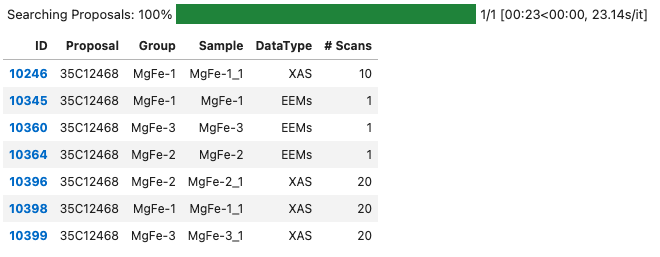
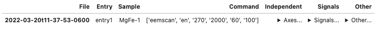
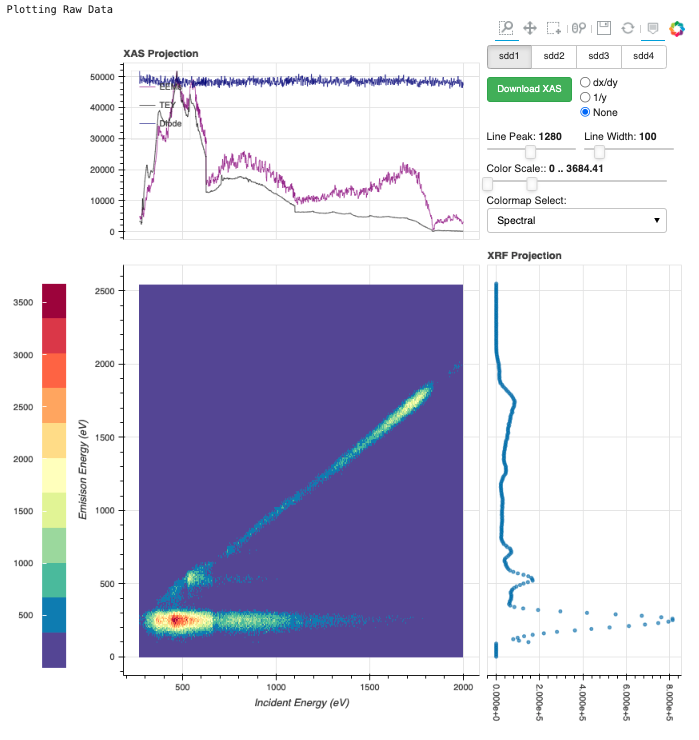

# Getting Started 
### Installation:
Using pip:
```commandline
pip install sgm-data
```
or from source: 
```commandline
git clone https://github.com/Canadian-Light-Source/sgmdata.git ./sgmdata
cd sgmdata
python setup.py install
```
### Site Usage:
```python
import sgmdata
sgmq = sgmdata.SGMQuery(sample='MgFe', proposal='35C12468', processed=True) #processed flag enables/disables collection of processed data from reports if it exists
sgmq
```
Out: 


```python
#Choosing a dataset
data = sgmq.data['10345']
data
```
Out:

```python
#plotting first entry in first scan
data.scans.first().first().plot()
```
Out:


### Local Usage:
First import the package, and select data to load in.
```python
import sgmdata 
data = sgmdata.SGMData(["file1.hdf5", "file2.hdf5", "..."])
```
This will identify the independent axis, signals and other data within the files listed. 

Useful functions:
```python
data.scans  #contains a dictionary of the identified data arrays loaded from your file list
data.interpolate(start=270, stop=2000, resolution=0.5) #bin the data in scans dictionary and interpolates missing points
data.mean() #average data with the same sample name, and spec command together.
```
Working with individual scans:
```python
df = data.scans['FilePrefix'].entry1.interpolate(start=270, stop=2000, resolution=0.1) #bin data for a single scan.
df2 = data.scans['FilePrefix'].entry1.fit_mcas() #perform batch gaussian fitting of interpolated SDD signal
```
Plotting (with [Bokeh](https://docs.bokeh.org/en/latest/index.html)):
```python
data.scans['FilePrefix'].entry1.plot()
data.averaged['SampleName'].plot()
```